<div align = center>
    <a href="https://discord.gg/AYbJ9MJez7">

    </a>
</div>
<div align = center><br></div>

# Theme Gallery

<!-- TABLE_START -->
| Theme | Description | Author |
| --- | --- | --- |
| [](#code-garden) | A sleek and transparent, color-agnostic theme. | [jacobfranco](https://github.com/jacobfranco) |
| [](#vanta-black) | Vanta Black inspired theme having the deepest blacks | [rishav12s](https://github.com/rishav12s) |
| [](#bad-blood) | Red & Black based theme. | [HyDE-Project](https://github.com/HyDE-Project) |
| [](#crimson-blue) | Red with Blue vibes | [amit-0i](https://github.com/amit-0i) |
| [](#obsidian-purple) | Where mystery meets elegance. | [amit-0i](https://github.com/amit-0i) |
| [](#ancientaliens) | A futuristic alien-like theme. Designed to invoke the feelings of watching the History channel at three in the morning. | [dim-ghub](https://github.com/dim-ghub) |
| [](#greenify) | Dark Green based theme for Hyde | [mahaveergurjar](https://github.com/mahaveergurjar) |
| [](#another-world) | Step beyond the horizon, where reality fades and imagination reigns supreme. | [cyb3rgh0u1](https://github.com/cyb3rgh0u1) |
| [](#hack-the-box) | Hacker based theme | [T-Crypt](https://github.com/T-Crypt) |
| [](#1-bit) | Monochrome based theme | [amit-0i](https://github.com/amit-0i) |
| [](#oxo-carbon) | Oxo Carbon based theme for Hyde | [rishav12s](https://github.com/rishav12s) |
| [](#decay-green) | Official Theme | [prasanthrangan](https://github.com/prasanthrangan) |
| [](#abyssal-wave) | Dive into the deep, where elegance meets the infinite night. | [Itz-Abhishek-Tiwari](https://github.com/Itz-Abhishek-Tiwari) |
| [](#limefrenzy) | Lime’s rhythm splits the night, where chaos crafts the vibe. | [xaicat](https://github.com/xaicat) |
| [](#ever-blushing) | Ever-Blush inspired dark aesthetic minimal theme | [rishav12s](https://github.com/rishav12s) |
| [](#nightbrew) | A rich, dark theme crafted for late-night productivity and sleek aesthetics. | [jackpawlik1](https://github.com/jackpawlik1) |
| [](#doombringers) | When shadows catch fire, sharp edges leave their mark. | [xaicat](https://github.com/xaicat) |
| [](#peace-of-mind) | Finally, some peace of mind... | [Maroc02](https://github.com/Maroc02) |
| [](#crimson-blade) | A striking fusion of sharp elegance, cutting through the darkness with bold hues. | [cyb3rgh0u1](https://github.com/cyb3rgh0u1) |
| [](#one-dark) | One Dark based theme | [RAprogramm](https://github.com/RAprogramm) |
| [](#graphite-mono) | Official Theme | [prasanthrangan](https://github.com/prasanthrangan) |
| [](#breezy-autumn) | Autumn, what a cozy time... | [Maroc02](https://github.com/Maroc02) |
| [](#electra) | Where darkness meets brilliance | [XBEAST1](https://github.com/XBEAST1) |
| [](#rain-dark) | Cozy new Rain based theme for HyDE | [rishav12s](https://github.com/rishav12s) |
| [](#joker) | Its for you Izumi. | [saber-88](https://github.com/saber-88) |
| [](#grukai) | Where retro warmth meets modern edge | [amit-0i](https://github.com/amit-0i) |
| [](#pixel-dream) | Pixel Art inspired theme | [rishav12s](https://github.com/rishav12s) |
| [](#timeless-dream) | Maybe, it's all just a dream... | [Maroc02](https://github.com/Maroc02) |
| [](#monokai) | Monokai based theme for Hyde | [mahaveergurjar](https://github.com/mahaveergurjar) |
| [](#nier) | Green dominant Nier Inspired Theme. | [saber-88](https://github.com/saber-88) |
| [](#dracula) | Dracula based theme | [RAprogramm](https://github.com/RAprogramm) |
| [](#eternal-arctic) | Serene Nord-inspired theme having frosty aesthetic blues | [rishav12s](https://github.com/rishav12s) |
| [](#solarized-dark) | Solarized Dark based theme for HyDE | [rishav12s](https://github.com/rishav12s) |
| [](#gruvbox-retro) | Official Theme | [prasanthrangan](https://github.com/prasanthrangan) |
| [](#oregairu) | HyDE theme inspired by Oregairu | [elritardato](https://github.com/elritardato) |
| [](#abyssgreen) | AbyssGreen is a theme based on the Everforst color scheme | [Itz-Abhishek-Tiwari](https://github.com/Itz-Abhishek-Tiwari) |
| [](#bluesky) | A serene theme inspired by bright cloudy skies | [richen604](https://github.com/richen604) |
| [](#monterey-frost) | Mac-OS inspired dark theme | [rishav12s](https://github.com/rishav12s) |
| [](#moonlight) | Gentle, soft moonlight lingers on my face... | [Maroc02](https://github.com/Maroc02) |
| [](#paranoid-sweet) | Dark purple based theme for HyDE | [rishav12s](https://github.com/rishav12s) |
| [](#sci-fi) | Sci-fi based theme | [KaranRaval555](https://github.com/KaranRaval555) |
| [](#scarlet-night) | Hot-Red + Deep-Black | [abenezerw](https://github.com/abenezerw) |
| [](#cosmic-blue) | Out there, somewhere in our galaxy... | [Maroc02](https://github.com/Maroc02) |
| [](#synth-wave) | Official Theme | [prasanthrangan](https://github.com/prasanthrangan) |
| [](#tundra) | A Soothing, Pastel Tundra Theme. | [Prof-Shiba](https://github.com/Prof-Shiba) |
| [](#red-stone) | Hot Red based theme | [mahaveergurjar](https://github.com/mahaveergurjar) |
| [](#virtual-witches) | HyDE theme based on Catppuccin Frappe and Virtual Witch Phenomenon | [G00380316](https://github.com/G00380316) |
| [](#windows-11) | We love Windows! Wew | [T-Crypt](https://github.com/T-Crypt) |
| [](#amethyst-aura) | A vibrant purple-themed style with ethereal accents | [jackpawlik1](https://github.com/jackpawlik1) |
| [](#mac-os) | Official Theme | [T-Crypt](https://github.com/T-Crypt) |
| [](#ice-age) | Winter based Ice Age theme for Hyde | [saber-88](https://github.com/saber-88) |
| [](#nordic-blue) | Official Theme | [prasanthrangan](https://github.com/prasanthrangan) |
| [](#catppuccin-latte) | Official Theme | [prasanthrangan](https://github.com/prasanthrangan) |
| [](#tokyo-night) | Official Theme | [prasanthrangan](https://github.com/prasanthrangan) |
| [](#catppuccin-macchiato) | Catppuccin Macchiato with Mauve Accent | [deepu105](https://github.com/deepu105) |
| [](#rosé-pine) | Official Theme | [prasanthrangan](https://github.com/prasanthrangan) |
| [](#green-lush) | A ghibli based theme for Hyde | [abenezerw](https://github.com/abenezerw) |
| [](#frosted-glass) | Official Theme | [prasanthrangan](https://github.com/prasanthrangan) |
| [](#catppuccin-mocha) | Official Theme | [prasanthrangan](https://github.com/prasanthrangan) |
| [](#edge-runner) | Official Theme | [prasanthrangan](https://github.com/prasanthrangan) |
| [](#material-sakura) | Official Theme | [prasanthrangan](https://github.com/prasanthrangan) |
| [](#cat-latte) | Better Catppuccin-Latte that fixes the inconsistencies of the official theme | [rishav12s](https://github.com/rishav12s) |

<!-- TABLE_END -->

---

\*All theme tags are linked to their corresponding repositories.

\*For more information, see [Making a Theme](https://hydeproject.pages.dev/en/theming/making-themes).

## Usage

> [!IMPORTANT]
>
> - Make sure you have installed [HyDE](https://github.com/Hyde-project/HyDE)
> - And also [hydectl](https://github.com/HyDE-Project/hydectl)

```shell

> + Execute `hydectl theme import` inside your terminal

> + Choose your theme
```


## Additional

> [!TIP]
>
> - You can also add Url-links or File path with single quotations ' ' for installing a specific theme

```shell
hydectl theme import --name "Theme-Name" --url "/Path/to/Configs"
hydectl theme import --name "Theme Name" --url https://github.com/User/Repository
hydectl theme import --name "Theme-Name" --url "https://github.com/User/Repository/tree/branch"
```

example

```
hydectl theme import --name 'Hack the Box' --url 'https://github.com/HyDE-Project/Hyde-gallery'
```

> [!NOTE]
> Incase themes have archive updates. export `FORCE_THEME_UPDATE=true` to update Gtk, Icons, Cursors & Font.

```shell
 export FORCE_THEME_UPDATE=true
```

## Rising Stars ⭐

<!-- ALL-CONTRIBUTORS-LIST:START - Do not remove or modify this section -->
<!-- prettier-ignore-start -->
<!-- markdownlint-disable -->
<table>
  <tbody>
    <tr>
      <td align="center" valign="top" width="14.28%"><a href="https://github.com/amit-0i"><br /><sub><b>amit</b></sub></a><br /><a href="#design-amit-0i" title="Design">🎨</a></td>
      <td align="center" valign="top" width="14.28%"><a href="https://github.com/jacobfranco"><br /><sub><b>jacob</b></sub></a><br /><a href="#design-jacobfranco" title="Design">🎨</a></td>
      <td align="center" valign="top" width="14.28%"><a href="https://github.com/xaicat"><br /><sub><b>xaicat</b></sub></a><br /><a href="#design-xaicat" title="Design">🎨</a></td>
      <td align="center" valign="top" width="14.28%"><a href="https://github.com/Maroc02"><br /><sub><b>marocc</b></sub></a><br /><a href="#design-Maroc02" title="Design">🎨</a></td>
    </tr>
  </tbody>
</table>

<!-- markdownlint-restore -->
<!-- prettier-ignore-end -->

<!-- ALL-CONTRIBUTORS-LIST:END -->

See how to [contribute](CONTRIBUTING.md) to the gallery.

---

<!-- GALLERY_START -->

# Explore 62 worlds of color and imagination 🪄.

<a id="1-bit"></a>
### 1. 1-Bit

**By:** [amit-0i](https://github.com/amit-0i)

**Description:** Monochrome based theme

[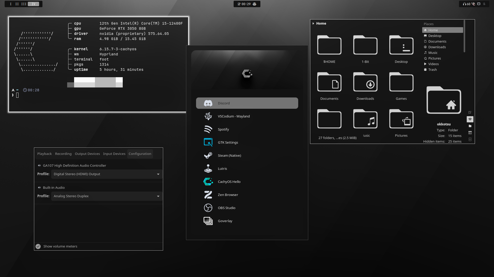](https://github.com/amit-0i/1-Bit) <a href="#theme-gallery" title="Back to top"></a>

---

<a id="abyssal-wave"></a>
### 2. Abyssal-Wave

**By:** [Itz-Abhishek-Tiwari](https://github.com/Itz-Abhishek-Tiwari)

**Description:** Dive into the deep, where elegance meets the infinite night.

[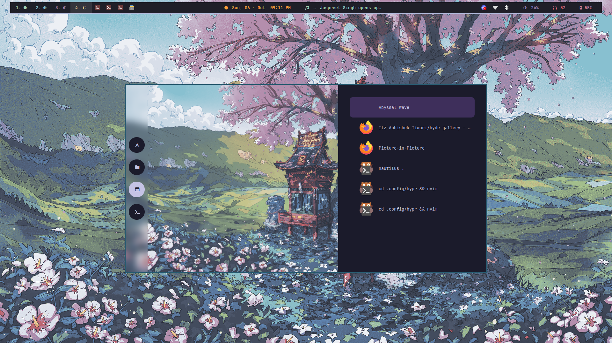](https://github.com/Itz-Abhishek-Tiwari/Abyssal-Wave/tree/main) <a href="#theme-gallery" title="Back to top"></a>

---

<a id="abyssgreen"></a>
### 3. AbyssGreen

**By:** [Itz-Abhishek-Tiwari](https://github.com/Itz-Abhishek-Tiwari)

**Description:** AbyssGreen is a theme based on the Everforst color scheme

[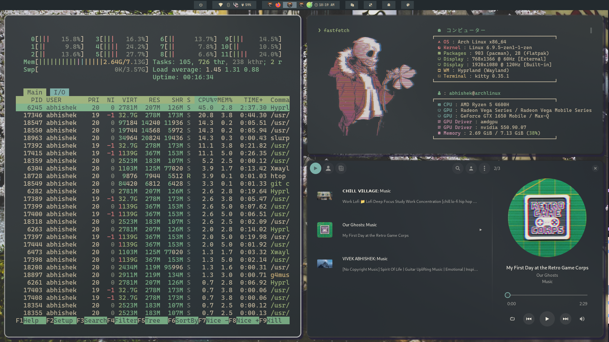](https://github.com/Itz-Abhishek-Tiwari/AbyssGreen) <a href="#theme-gallery" title="Back to top"></a>

---

<a id="amethyst-aura"></a>
### 4. Amethyst-Aura

**By:** [jackpawlik1](https://github.com/jackpawlik1)

**Description:** A vibrant purple-themed style with ethereal accents

[](https://github.com/jackpawlik1/Amethyst-Aura) <a href="#theme-gallery" title="Back to top"></a>

---

<a id="ancientaliens"></a>
### 5. AncientAliens

**By:** [dim-ghub](https://github.com/dim-ghub)

**Description:** A futuristic alien-like theme. Designed to invoke the feelings of watching the History channel at three in the morning.

[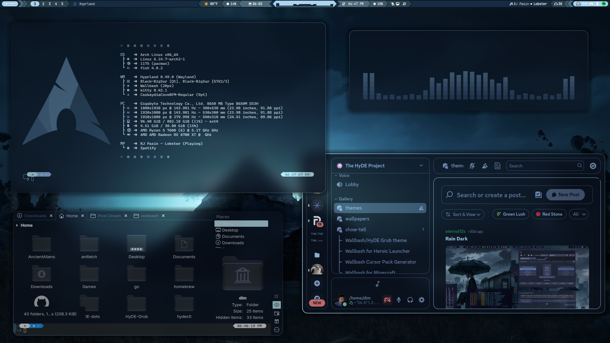](https://github.com/dim-ghub/AncientAliens) <a href="#theme-gallery" title="Back to top"></a>

---

<a id="another-world"></a>
### 6. Another World

**By:** [cyb3rgh0u1](https://github.com/cyb3rgh0u1)

**Description:** Step beyond the horizon, where reality fades and imagination reigns supreme.

[](https://github.com/cyb3rgh0u1/Another-World) <a href="#theme-gallery" title="Back to top"></a>

---

<a id="bad-blood"></a>
### 7. Bad Blood

**By:** [HyDE-Project](https://github.com/HyDE-Project)

**Description:** Red & Black based theme.

[](https://github.com/HyDE-Project/hyde-gallery/tree/Bad-Blood) <a href="#theme-gallery" title="Back to top"></a>

---

<a id="bluesky"></a>
### 8. BlueSky

**By:** [richen604](https://github.com/richen604)

**Description:** A serene theme inspired by bright cloudy skies

[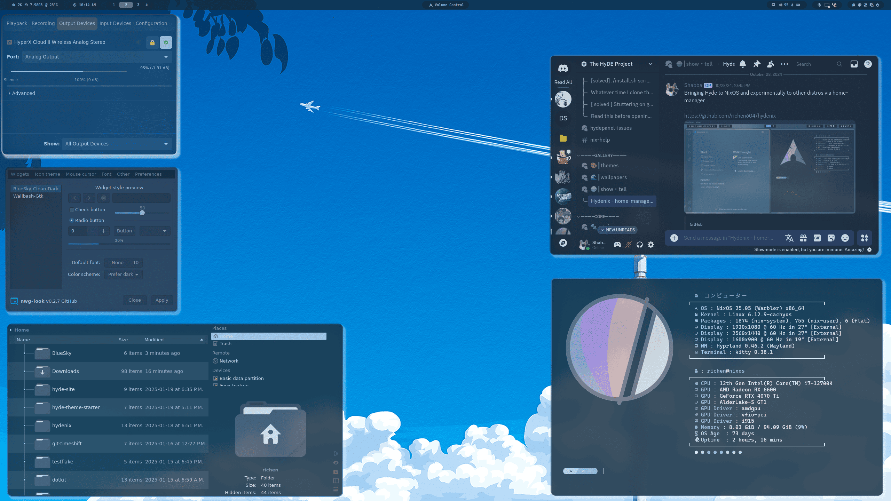](https://github.com/richen604/BlueSky) <a href="#theme-gallery" title="Back to top"></a>

---

<a id="breezy-autumn"></a>
### 9. Breezy Autumn

**By:** [Maroc02](https://github.com/Maroc02)

**Description:** Autumn, what a cozy time...

[](https://github.com/Maroc02/Breezy-Autumn) <a href="#theme-gallery" title="Back to top"></a>

---

<a id="cat-latte"></a>
### 10. Cat Latte

**By:** [rishav12s](https://github.com/rishav12s)

**Description:** Better Catppuccin-Latte that fixes the inconsistencies of the official theme

[](https://github.com/rishav12s/Cat-Latte) <a href="#theme-gallery" title="Back to top"></a>

---

<a id="catppuccin-latte"></a>
### 11. Catppuccin Latte

**By:** [prasanthrangan](https://github.com/prasanthrangan)

**Description:** Official Theme

[](https://github.com/HyDE-Project/hyde-themes/tree/Catppuccin-Latte) <a href="#theme-gallery" title="Back to top"></a>

---

<a id="catppuccin-mocha"></a>
### 12. Catppuccin Mocha

**By:** [prasanthrangan](https://github.com/prasanthrangan)

**Description:** Official Theme

[](https://github.com/HyDE-Project/hyde-themes/tree/Catppuccin-Mocha) <a href="#theme-gallery" title="Back to top"></a>

---

<a id="catppuccin-macchiato"></a>
### 13. Catppuccin-Macchiato

**By:** [deepu105](https://github.com/deepu105)

**Description:** Catppuccin Macchiato with Mauve Accent

[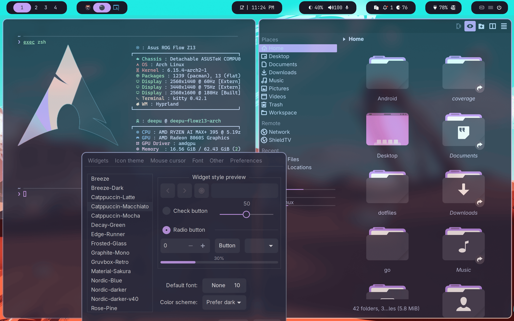](https://github.com/deepu105/hyde-theme-catppuccin-macchiato) <a href="#theme-gallery" title="Back to top"></a>

---

<a id="code-garden"></a>
### 14. Code Garden

**By:** [jacobfranco](https://github.com/jacobfranco)

**Description:** A sleek and transparent, color-agnostic theme.

[](https://github.com/jacobfranco/Code-Garden) <a href="#theme-gallery" title="Back to top"></a>

---

<a id="cosmic-blue"></a>
### 15. Cosmic Blue

**By:** [Maroc02](https://github.com/Maroc02)

**Description:** Out there, somewhere in our galaxy...

[](https://github.com/Maroc02/Cosmic-Blue) <a href="#theme-gallery" title="Back to top"></a>

---

<a id="crimson-blade"></a>
### 16. Crimson Blade

**By:** [cyb3rgh0u1](https://github.com/cyb3rgh0u1)

**Description:** A striking fusion of sharp elegance, cutting through the darkness with bold hues.

[](https://github.com/cyb3rgh0u1/Crimson-Blade) <a href="#theme-gallery" title="Back to top"></a>

---

<a id="crimson-blue"></a>
### 17. Crimson-Blue

**By:** [amit-0i](https://github.com/amit-0i)

**Description:** Red with Blue vibes

[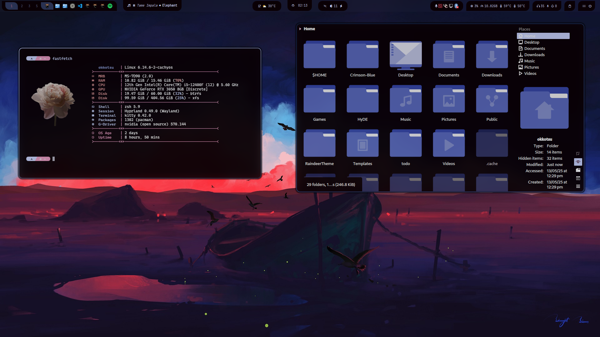](https://github.com/amit-0i/Crimson-Blue) <a href="#theme-gallery" title="Back to top"></a>

---

<a id="decay-green"></a>
### 18. Decay Green

**By:** [prasanthrangan](https://github.com/prasanthrangan)

**Description:** Official Theme

[](https://github.com/HyDE-Project/hyde-themes/tree/Decay-Green) <a href="#theme-gallery" title="Back to top"></a>

---

<a id="doombringers"></a>
### 19. DoomBringers

**By:** [xaicat](https://github.com/xaicat)

**Description:** When shadows catch fire, sharp edges leave their mark.

[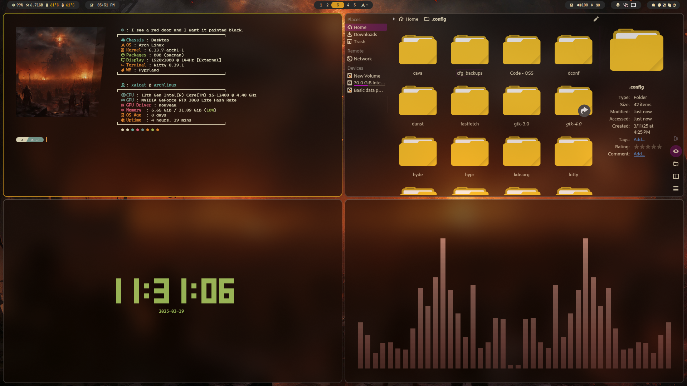](https://github.com/xaicat/DoomBringers) <a href="#theme-gallery" title="Back to top"></a>

---

<a id="dracula"></a>
### 20. Dracula

**By:** [RAprogramm](https://github.com/RAprogramm)

**Description:** Dracula based theme

[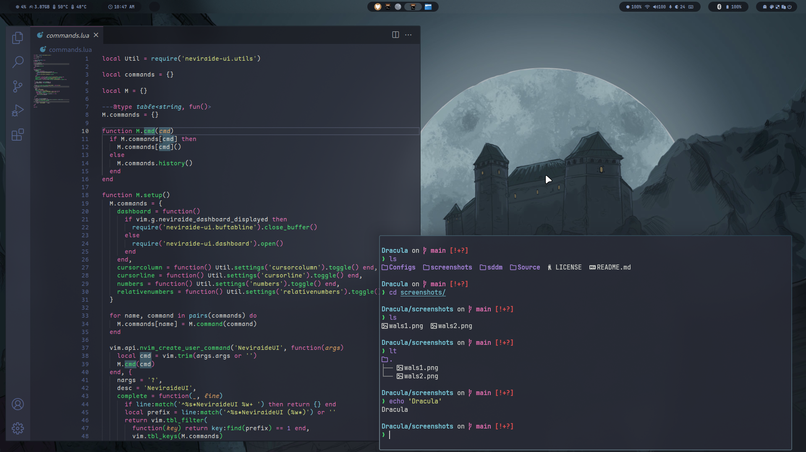](https://github.com/RAprogramm/HyDe-Themes/tree/Dracula) <a href="#theme-gallery" title="Back to top"></a>

---

<a id="edge-runner"></a>
### 21. Edge Runner

**By:** [prasanthrangan](https://github.com/prasanthrangan)

**Description:** Official Theme

[](https://github.com/HyDE-Project/hyde-themes/tree/Edge-Runner) <a href="#theme-gallery" title="Back to top"></a>

---

<a id="electra"></a>
### 22. Electra

**By:** [XBEAST1](https://github.com/XBEAST1)

**Description:** Where darkness meets brilliance

[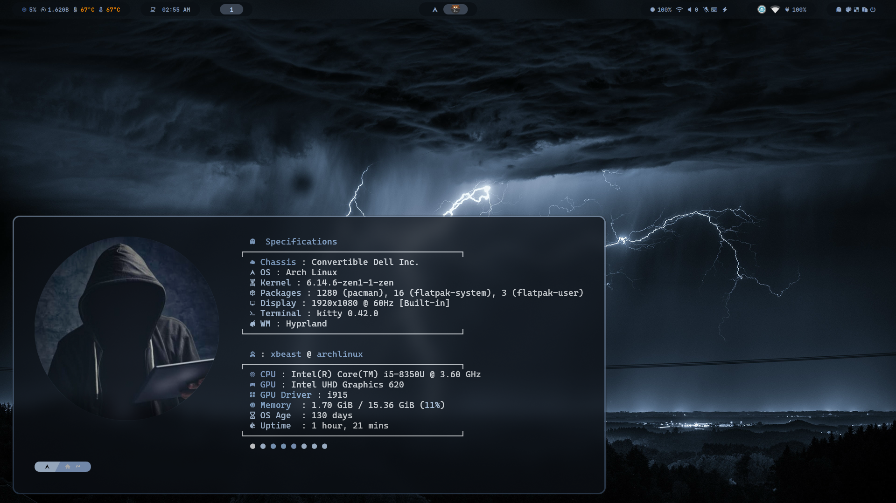](https://github.com/XBEAST1/Electra) <a href="#theme-gallery" title="Back to top"></a>

---

<a id="eternal-arctic"></a>
### 23. Eternal Arctic

**By:** [rishav12s](https://github.com/rishav12s)

**Description:** Serene Nord-inspired theme having frosty aesthetic blues

[](https://github.com/rishav12s/Eternal-Arctic) <a href="#theme-gallery" title="Back to top"></a>

---

<a id="ever-blushing"></a>
### 24. Ever Blushing

**By:** [rishav12s](https://github.com/rishav12s)

**Description:** Ever-Blush inspired dark aesthetic minimal theme

[](https://github.com/rishav12s/Ever-Blushing) <a href="#theme-gallery" title="Back to top"></a>

---

<a id="frosted-glass"></a>
### 25. Frosted Glass

**By:** [prasanthrangan](https://github.com/prasanthrangan)

**Description:** Official Theme

[](https://github.com/HyDE-Project/hyde-themes/tree/Frosted-Glass) <a href="#theme-gallery" title="Back to top"></a>

---

<a id="graphite-mono"></a>
### 26. Graphite Mono

**By:** [prasanthrangan](https://github.com/prasanthrangan)

**Description:** Official Theme

[](https://github.com/HyDE-Project/hyde-themes/tree/Graphite-Mono) <a href="#theme-gallery" title="Back to top"></a>

---

<a id="green-lush"></a>
### 27. Green Lush

**By:** [abenezerw](https://github.com/abenezerw)

**Description:** A ghibli based theme for Hyde

[](https://github.com/abenezerw/Green-Lush) <a href="#theme-gallery" title="Back to top"></a>

---

<a id="greenify"></a>
### 28. Greenify

**By:** [mahaveergurjar](https://github.com/mahaveergurjar)

**Description:** Dark Green based theme for Hyde

[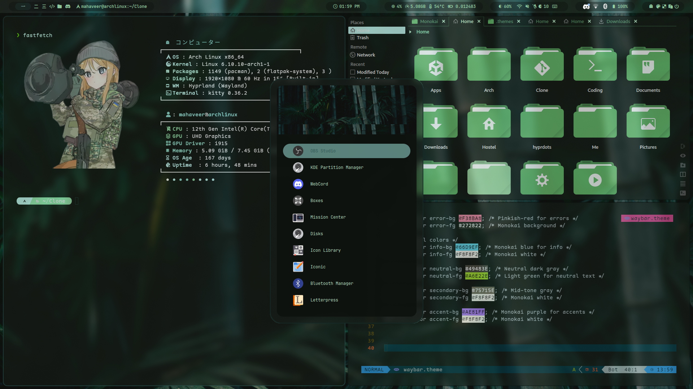](https://github.com/mahaveergurjar/Theme-Gallery/tree/Greenify) <a href="#theme-gallery" title="Back to top"></a>

---

<a id="grukai"></a>
### 29. Grukai

**By:** [amit-0i](https://github.com/amit-0i)

**Description:** Where retro warmth meets modern edge

[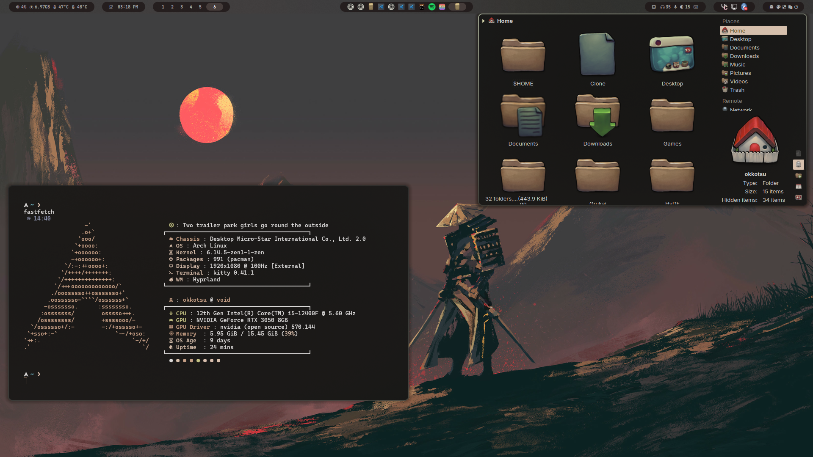](https://github.com/amit-0i/Grukai) <a href="#theme-gallery" title="Back to top"></a>

---

<a id="gruvbox-retro"></a>
### 30. Gruvbox Retro

**By:** [prasanthrangan](https://github.com/prasanthrangan)

**Description:** Official Theme

[](https://github.com/HyDE-Project/hyde-themes/tree/Gruvbox-Retro) <a href="#theme-gallery" title="Back to top"></a>

---

<a id="hack-the-box"></a>
### 31. Hack the Box

**By:** [T-Crypt](https://github.com/T-Crypt)

**Description:** Hacker based theme

[](https://github.com/HyDE-Project/hyde-gallery/tree/Hack-the-Box) <a href="#theme-gallery" title="Back to top"></a>

---

<a id="ice-age"></a>
### 32. Ice Age

**By:** [saber-88](https://github.com/saber-88)

**Description:** Winter based Ice Age theme for Hyde

[](https://github.com/saber-88/Ice-Age) <a href="#theme-gallery" title="Back to top"></a>

---

<a id="joker"></a>
### 33. Joker

**By:** [saber-88](https://github.com/saber-88)

**Description:** Its for you Izumi.

[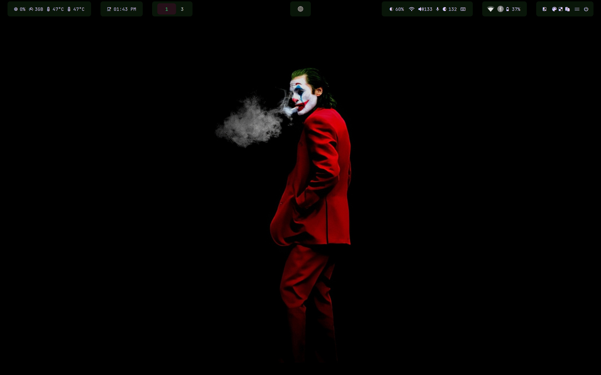](https://github.com/saber-88/Joker) <a href="#theme-gallery" title="Back to top"></a>

---

<a id="limefrenzy"></a>
### 34. LimeFrenzy

**By:** [xaicat](https://github.com/xaicat)

**Description:** Lime’s rhythm splits the night, where chaos crafts the vibe.

[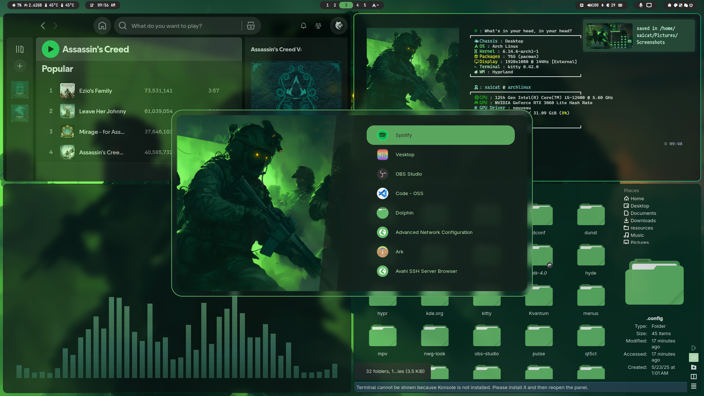](https://github.com/xaicat/LimeFrenzy) <a href="#theme-gallery" title="Back to top"></a>

---

<a id="mac-os"></a>
### 35. Mac OS

**By:** [T-Crypt](https://github.com/T-Crypt)

**Description:** Official Theme

[](https://github.com/HyDE-Project/hyde-gallery/tree/Mac-Os) <a href="#theme-gallery" title="Back to top"></a>

---

<a id="material-sakura"></a>
### 36. Material Sakura

**By:** [prasanthrangan](https://github.com/prasanthrangan)

**Description:** Official Theme

[](https://github.com/HyDE-Project/hyde-themes/tree/Material-Sakura) <a href="#theme-gallery" title="Back to top"></a>

---

<a id="monokai"></a>
### 37. Monokai

**By:** [mahaveergurjar](https://github.com/mahaveergurjar)

**Description:** Monokai based theme for Hyde

[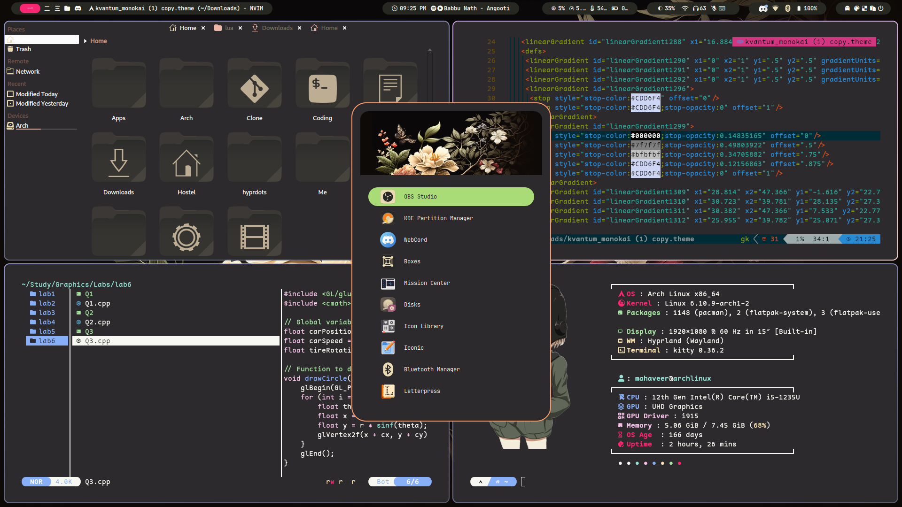](https://github.com/mahaveergurjar/Theme-Gallery/tree/Monokai) <a href="#theme-gallery" title="Back to top"></a>

---

<a id="monterey-frost"></a>
### 38. Monterey Frost

**By:** [rishav12s](https://github.com/rishav12s)

**Description:** Mac-OS inspired dark theme

[](https://github.com/rishav12s/Monterey-Frost) <a href="#theme-gallery" title="Back to top"></a>

---

<a id="moonlight"></a>
### 39. Moonlight

**By:** [Maroc02](https://github.com/Maroc02)

**Description:** Gentle, soft moonlight lingers on my face...

[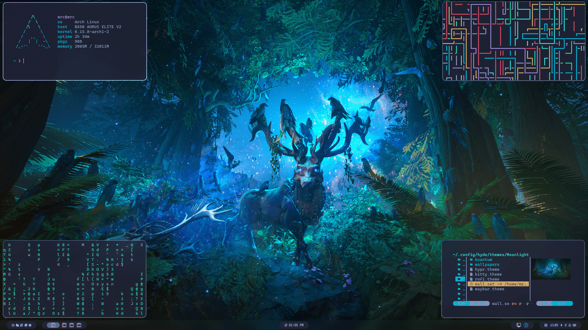](https://github.com/Maroc02/Moonlight) <a href="#theme-gallery" title="Back to top"></a>

---

<a id="nier"></a>
### 40. Nier

**By:** [saber-88](https://github.com/saber-88)

**Description:** Green dominant Nier Inspired Theme.

[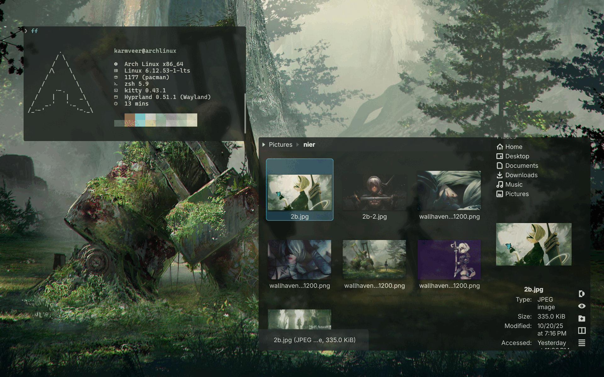](https://github.com/saber-88/Nier) <a href="#theme-gallery" title="Back to top"></a>

---

<a id="nightbrew"></a>
### 41. Nightbrew

**By:** [jackpawlik1](https://github.com/jackpawlik1)

**Description:** A rich, dark theme crafted for late-night productivity and sleek aesthetics.

[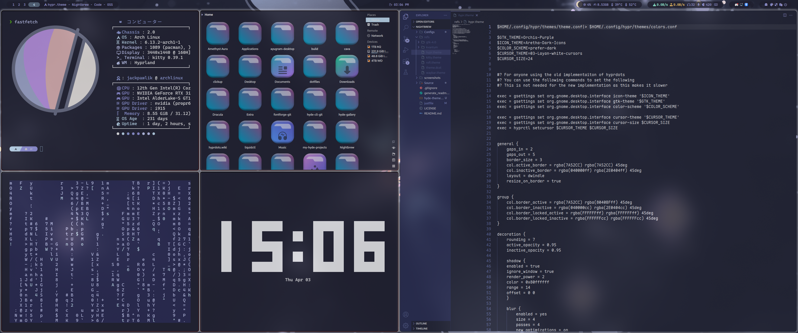](https://github.com/jackpawlik1/Nightbrew) <a href="#theme-gallery" title="Back to top"></a>

---

<a id="nordic-blue"></a>
### 42. Nordic Blue

**By:** [prasanthrangan](https://github.com/prasanthrangan)

**Description:** Official Theme

[](https://github.com/HyDE-Project/hyde-themes/tree/Nordic-Blue) <a href="#theme-gallery" title="Back to top"></a>

---

<a id="obsidian-purple"></a>
### 43. Obsidian-Purple

**By:** [amit-0i](https://github.com/amit-0i)

**Description:** Where mystery meets elegance.

[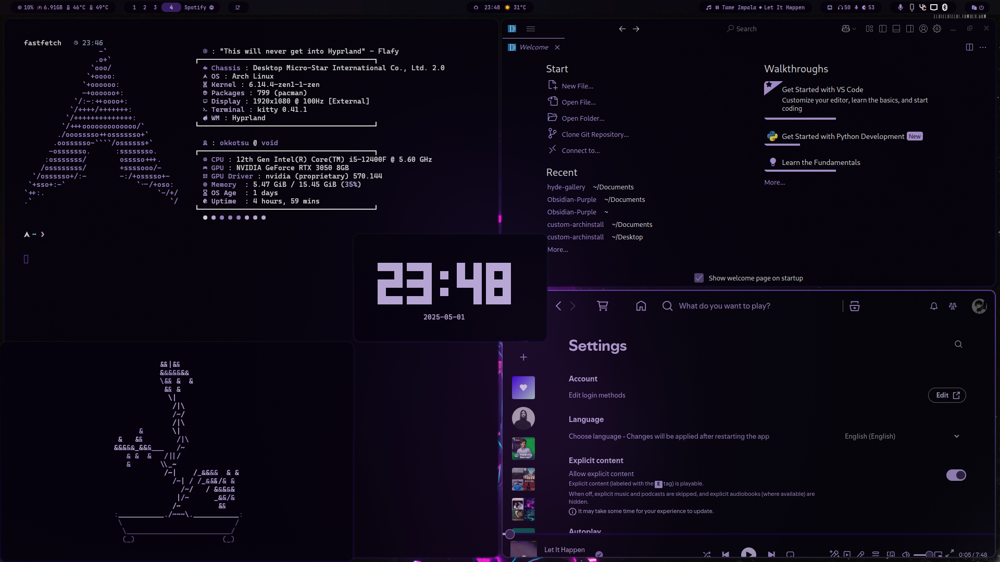](https://github.com/amit-0i/Obsidian-Purple) <a href="#theme-gallery" title="Back to top"></a>

---

<a id="one-dark"></a>
### 44. One Dark

**By:** [RAprogramm](https://github.com/RAprogramm)

**Description:** One Dark based theme

[](https://github.com/RAprogramm/HyDe-Themes/tree/One-Dark) <a href="#theme-gallery" title="Back to top"></a>

---

<a id="oregairu"></a>
### 45. Oregairu

**By:** [elritardato](https://github.com/elritardato)

**Description:** HyDE theme inspired by Oregairu

[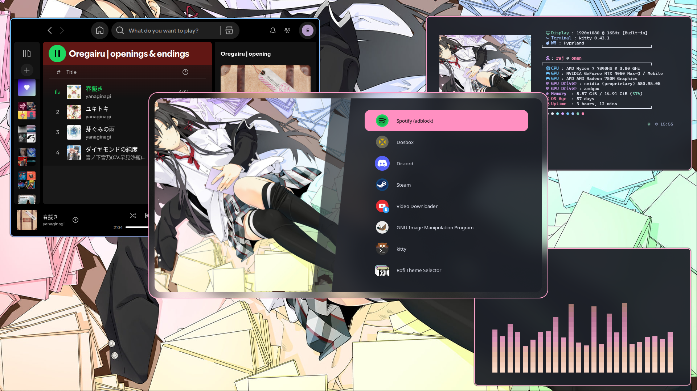](https://github.com/elritardato/Oregairu) <a href="#theme-gallery" title="Back to top"></a>

---

<a id="oxo-carbon"></a>
### 46. Oxo Carbon

**By:** [rishav12s](https://github.com/rishav12s)

**Description:** Oxo Carbon based theme for Hyde

[](https://github.com/rishav12s/Oxo-Carbon) <a href="#theme-gallery" title="Back to top"></a>

---

<a id="paranoid-sweet"></a>
### 47. Paranoid Sweet

**By:** [rishav12s](https://github.com/rishav12s)

**Description:** Dark purple based theme for HyDE

[](https://github.com/rishav12s/Paranoid-Sweet) <a href="#theme-gallery" title="Back to top"></a>

---

<a id="peace-of-mind"></a>
### 48. Peace Of Mind

**By:** [Maroc02](https://github.com/Maroc02)

**Description:** Finally, some peace of mind...

[](https://github.com/Maroc02/Peace-Of-Mind) <a href="#theme-gallery" title="Back to top"></a>

---

<a id="pixel-dream"></a>
### 49. Pixel Dream

**By:** [rishav12s](https://github.com/rishav12s)

**Description:** Pixel Art inspired theme

[](https://github.com/rishav12s/Pixel-Dream) <a href="#theme-gallery" title="Back to top"></a>

---

<a id="rain-dark"></a>
### 50. Rain Dark

**By:** [rishav12s](https://github.com/rishav12s)

**Description:** Cozy new Rain based theme for HyDE

[](https://github.com/rishav12s/Rain-Dark) <a href="#theme-gallery" title="Back to top"></a>

---

<a id="red-stone"></a>
### 51. Red Stone

**By:** [mahaveergurjar](https://github.com/mahaveergurjar)

**Description:** Hot Red based theme

[](https://github.com/mahaveergurjar/Theme-Gallery/tree/Red_Stone) <a href="#theme-gallery" title="Back to top"></a>

---

<a id="rosé-pine"></a>
### 52. Rosé Pine

**By:** [prasanthrangan](https://github.com/prasanthrangan)

**Description:** Official Theme

[](https://github.com/HyDE-Project/hyde-themes/tree/Rose-Pine) <a href="#theme-gallery" title="Back to top"></a>

---

<a id="scarlet-night"></a>
### 53. Scarlet Night

**By:** [abenezerw](https://github.com/abenezerw)

**Description:** Hot-Red + Deep-Black

[](https://github.com/abenezerw/Scarlet-Night) <a href="#theme-gallery" title="Back to top"></a>

---

<a id="sci-fi"></a>
### 54. Sci-fi

**By:** [KaranRaval555](https://github.com/KaranRaval555)

**Description:** Sci-fi based theme

[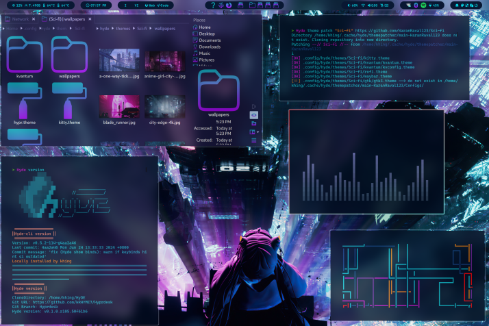](https://github.com/KaranRaval555/Sci-fi) <a href="#theme-gallery" title="Back to top"></a>

---

<a id="solarized-dark"></a>
### 55. Solarized Dark

**By:** [rishav12s](https://github.com/rishav12s)

**Description:** Solarized Dark based theme for HyDE

[](https://github.com/rishav12s/Solarized-Dark) <a href="#theme-gallery" title="Back to top"></a>

---

<a id="synth-wave"></a>
### 56. Synth Wave

**By:** [prasanthrangan](https://github.com/prasanthrangan)

**Description:** Official Theme

[](https://github.com/HyDE-Project/hyde-themes/tree/Synth-Wave) <a href="#theme-gallery" title="Back to top"></a>

---

<a id="timeless-dream"></a>
### 57. Timeless Dream

**By:** [Maroc02](https://github.com/Maroc02)

**Description:** Maybe, it's all just a dream...

[](https://github.com/Maroc02/Timeless-Dream) <a href="#theme-gallery" title="Back to top"></a>

---

<a id="tokyo-night"></a>
### 58. Tokyo Night

**By:** [prasanthrangan](https://github.com/prasanthrangan)

**Description:** Official Theme

[](https://github.com/HyDE-Project/hyde-themes/tree/Tokyo-Night) <a href="#theme-gallery" title="Back to top"></a>

---

<a id="tundra"></a>
### 59. Tundra

**By:** [Prof-Shiba](https://github.com/Prof-Shiba)

**Description:** A Soothing, Pastel Tundra Theme.

[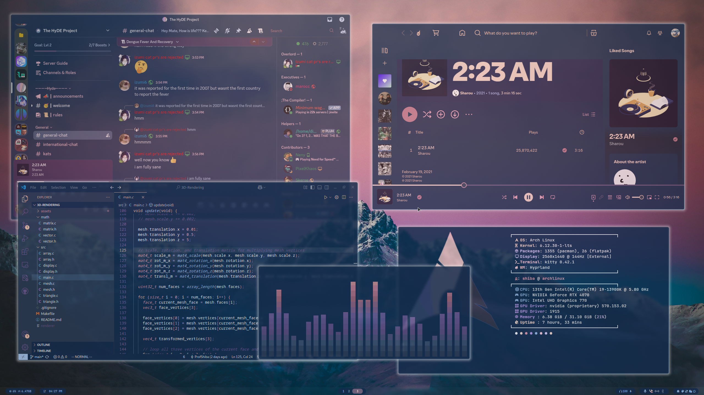](https://github.com/Prof-Shiba/Tundra) <a href="#theme-gallery" title="Back to top"></a>

---

<a id="vanta-black"></a>
### 60. Vanta Black

**By:** [rishav12s](https://github.com/rishav12s)

**Description:** Vanta Black inspired theme having the deepest blacks

[](https://github.com/rishav12s/Vanta-Black) <a href="#theme-gallery" title="Back to top"></a>

---

<a id="virtual-witches"></a>
### 61. Virtual-Witches

**By:** [G00380316](https://github.com/G00380316)

**Description:** HyDE theme based on Catppuccin Frappe and Virtual Witch Phenomenon

[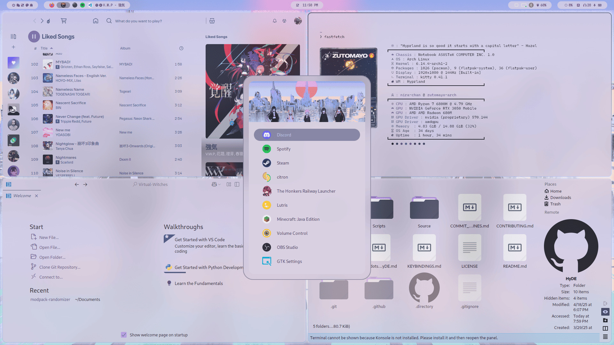](https://github.com/G00380316/virtual-witches) <a href="#theme-gallery" title="Back to top"></a>

---

<a id="windows-11"></a>
### 62. Windows 11

**By:** [T-Crypt](https://github.com/T-Crypt)

**Description:** We love Windows! Wew

[](https://github.com/HyDE-Project/hyde-gallery/tree/Windows-11) <a href="#theme-gallery" title="Back to top"></a>

---

<!-- GALLERY_END -->
